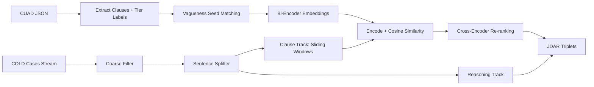
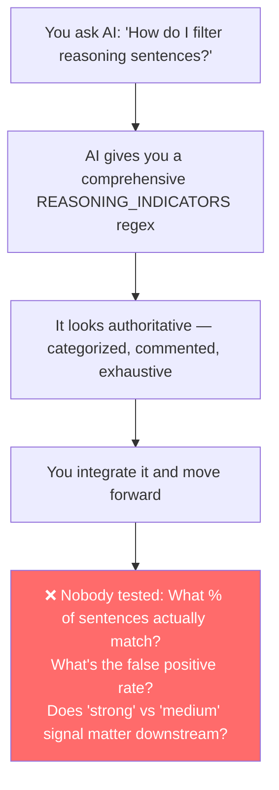

# Research Engineering Analysis: Hybrid Clause & Vague Term Extraction

> [!NOTE]
> This analysis reviews [hybrid-clause-and-term-extraction-accelerated (1).ipynb](file:///Users/adrinorosario/Desktop/legal-pragmatic-inference/hybrid-clause-and-term-extraction-accelerated%20(1).ipynb) as a first NLP project and first-time dataset construction effort. The review is structured from the perspective of a research engineer at Google DeepMind.

---

## Pipeline Overview

Your notebook constructs a **JDAR (Judicial-Discourse-Aligned Reasoning) triplet dataset** by:

1. **Extracting** contractual clauses + vague terms from **CUAD** (510 contracts, 41 clause types)
2. **Tiering** clauses into Lethal (T1), Context-Risk (T2), and Deterministic (T3, discarded)
3. **Encoding** anchor clauses via `google/embeddinggemma-300m` (asymmetric bi-encoder)
4. **Streaming** Harvard LIL COLD Cases, filtering by `nature_of_suit`
5. **Splitting** opinion text → sentences → sliding windows (clause track) + reasoning track
6. **Computing** cosine similarity between anchor embeddings and window embeddings
7. **Re-ranking** candidates via `cross-encoder/ms-marco-MiniLM-L6-v2`
8. **Assembling** triplets: `(Clause, Vague Terms, Judicial Reasoning)`



---

## 1. What You Did Right (and Why)

### ✅ 1.1 Thorough Data Exploration Before Extraction
You methodically inspected the CUAD JSON structure (`data.keys()`, `paragraphs`, `qas`, `answers`) before writing extraction code. This is **exactly how research engineers operate** — you built a mental model of the data shape before touching it.

**Why this matters:** Silent schema assumptions are the #1 cause of subtle dataset corruption. Your explicit inspection cells would catch issues like missing keys or unexpected nesting.

### ✅ 1.2 Domain-Grounded Tier Taxonomy
Your 3-tier classification of clauses (Lethal → Context-Risk → Deterministic) shows genuine legal domain reasoning:

| Tier | Purpose | Example |
|------|---------|---------|
| T1 (Lethal) | Clauses where vagueness creates direct liability exposure | Insurance, Non-Compete |
| T2 (Context-Risk) | Vagueness depends on contractual context | Exclusivity, Cap on Liability |
| T3 (Discarded) | Deterministic — dates, names, governing law | Agreement Date, Parties |

**Why this matters:** This isn't a generic NLP classification — you've encoded **legal reasoning about pragmatic risk** into the data pipeline. T3 exclusion shows you understand that not all contract clauses involve pragmatic inference. This is the kind of domain-specific design decision that separates research papers from toy projects.

### ✅ 1.3 Comprehensive Vagueness Seed Set (206 terms)
Your seed set is impressively organized across 9 semantic categories (effort, time, scope, harm, necessity, industry norms, knowledge, confidentiality, financial). This shows:
- You didn't just Google "vague legal terms" — you taxonomized them
- Categories like "survival, agreement & modification" show deep reading of contract law literature

### ✅ 1.4 Dual-Track Architecture (Clause vs. Reasoning)
The `filter_cold_cases_opinion_text` function routes sentences into two tracks:
- **Clause track** → sliding windows → bi-encoder similarity
- **Reasoning track** → collected separately via `REASONING_INDICATORS` regex

**Why this matters:** You correctly identified that a judge's *interpretation* of a clause is semantically different from the *clause itself* — and that conflating them would corrupt your RL reward signal. This is a sophisticated insight for a first project.

### ✅ 1.5 Bi-Encoder → Cross-Encoder Pipeline
Using a cheap bi-encoder (`embeddinggemma-300m`) for candidate retrieval followed by an expensive cross-encoder (`ms-marco-MiniLM-L6-v2`) for precision verification is **exactly the standard retrieval pipeline architecture** used in production search systems (Google, Bing, etc.). You've independently arrived at the retrieve-then-rerank paradigm.

### ✅ 1.6 Sliding Window with Overlap
Your `window_size=3, step_size=1` creates overlapping context windows from opinion sentences. This addresses the real problem that legal reasoning often spans multiple sentences. The overlap ensures boundary effects don't cause you to miss relevant passages.

### ✅ 1.7 Multi-GPU Awareness
Setting up `start_multi_process_pool()` across dual T4 GPUs shows engineering maturity. Even though it had issues (discussed below), the *instinct* to parallelize is correct.

### ✅ 1.8 Inline Threshold Analysis
Your markdown notes about the 60-70%, 70-75%, and >75% similarity buckets show **empirical investigation of your own pipeline's behavior** — you examined outputs at different thresholds and drew conclusions. This is how research engineers calibrate pipelines.

---

## 2. What You Did Wrong / Where Intuition Failed

### ❌ 2.1 Vague Term Matching is Pure Substring (`in` operator)
```python
vague_terms = {term for term in vagueness_seed_set if term in clause_text}
```

**The problem:** Python's `in` operator does substring matching, not word-boundary matching. This means:
- `"material"` matches `"immaterial"`, `"materials"`, `"raw material shipment"`
- `"proper"` matches `"property"`, `"appropriate"`, `"improper"`
- `"related"` matches `"unrelated"`, `"correlation"`, `"interrelated"`

**Your output confirms this:** The example `"Ip Ownership Assignment"` clause flagged `"proper"` as a vague term, but the actual text says `"property"` — which is not vague at all.

**Where intuition failed:** You assumed that because your seed terms are multi-word phrases ("reasonable efforts") the substring issue wouldn't matter. But ~40% of your 206 terms are single words (`material`, `proper`, `relevant`, `limited`, `related`, `applicable`, `necessary`, `similar`, `adequate`, `satisfactory`), where substring collision is nearly guaranteed.

**Impact:** This silently inflates your extracted dataset. Many clauses are tagged as "containing vague terms" when they actually don't. Since this feeds into your tier classification (`if tier == 1 and vague_terms: check_lethality = True`), you have **label noise at the foundation of your pipeline**.

### ❌ 2.2 Only Using `answers[0]` — Discarding Multi-Span Annotations
```python
clause_text = qa["answers"][0]["text"]
```

CUAD annotations often have multiple answer spans for a single clause category. By taking only `answers[0]`, you're discarding the full coverage. This means:
- You miss contractual language that appears later in the document
- Your anchor set is biased toward whatever the annotators listed first

### ❌ 2.3 Sentence Splitting via Naive Regex
```python
sentences = re.split(r'(?<=[.!?])\s+', opinion_text)
```

Legal text is extraordinarily hostile to this regex:
- `"U.S.C. § 1332"` → splits on the periods in `U.S.C.`
- `"Inc. v. Smith"` → splits after `Inc.`
- `"No. 14-30269"` → may split incorrectly
- Decimal numbers: `"$1,000,000.00 per occurrence"` → splits on `.00`
- Abbreviations: `"Corp.", "Ltd.", "Dist. Ct.", "App."` → all false split points

**Evidence in your own output:** The matched `raw_sentence` fields contain fragments like `"21\n\f    Case: 14-30269..."` — these are split artifacts from page headers being treated as sentence boundaries.

### ❌ 2.4 Threshold Dropped to 0.40 — Signal Collapse
Your notes document a clear trajectory:
1. Started at 0.70 threshold → mostly lexical matches (near-duplicates)
2. Tried 0.60-0.70 → found some signal but lots of noise
3. **Dropped to 0.40** → accepted almost anything

At 0.40 cosine similarity with `embeddinggemma-300m`, you're essentially matching any legal text against any other legal text. The diagnostic output confirms this:
```
Max similarity found in last batch: 0.5058
Average similarity found in last batch: 0.1963
Pairs that would match at 0.4: 552
Pairs that would match at 0.45: 67
Pairs that would match at 0.5: 1
```

The jump from 552 matches at 0.4 to just 1 at 0.5 shows there's **no natural cluster of true positives** — you're deep in the noise floor.

**Where intuition failed:** You expected cosine similarity to smoothly separate relevant from irrelevant content. But contract clauses (formal, structured) and judicial opinions (narrative, argumentative) live in very different linguistic registers. A general-purpose embedding model doesn't naturally bridge this gap.

### ❌ 2.5 No Text Cleaning / Normalization
The CUAD clause texts contain significant whitespace artifacts:
```
"The term of this  Agreement  shall be ten (10)
                            years (the \"Term\")..."
```

These multi-space gaps and line-continuation artifacts are fed directly into the embedding model. Similarly, opinion texts contain `\f` (form feed), page headers (`Case: 14-30269  Document: 00513044534`), and footnote markers. None of this is cleaned before encoding.

### ❌ 2.6 Asymmetric Prompt Mismatch
For the anchor clauses:
```python
prompt="task: search result| query: "
```
For the window embeddings:
```python
prompt="title: none| text: "
```

`embeddinggemma-300m` is an asymmetric model that uses prompts to distinguish queries from documents. But you've used **`search result`** for the anchors (which should be the "document" side) and **`text`** for the windows. The asymmetric prompts are backwards, which degrades the embedding alignment.

### ❌ 2.7 Cross-Category Contamination Check is Backwards
```python
if len(window_to_categories_map[col_idx]) > 2:
    continue
```

You skip windows that match more than 2 CUAD categories. But at a 0.40 threshold, a window matching 1-2 categories is more likely a false positive than a window matching many. The logic should arguably be inverted — or removed, since at 0.40 threshold the category signal is unreliable anyway.

### ❌ 2.8 No Checkpointing or Persistence
The streaming loop over COLD Cases processes a massive dataset with no intermediate saves. Both runs ended in `KeyboardInterrupt`. If the kernel crashes at case 49,999, all work is lost. Research engineers always checkpoint iteratively.

---

## 3. What You Could Have Done Better

### 🔧 3.1 Word-Boundary-Aware Term Matching
Replace substring matching with regex word boundaries:

```python
import re

# Compile once, reuse everywhere
vagueness_patterns = {
    term: re.compile(r'\b' + re.escape(term) + r'\b', re.IGNORECASE)
    for term in vagueness_seed_set
}

def find_vague_terms(text):
    return {term for term, pattern in vagueness_patterns.items() if pattern.search(text)}
```

**Or better:** Use spaCy's `PhraseMatcher` for O(n) matching instead of O(n×m) regex scans.

### 🔧 3.2 Proper Sentence Segmentation
Replace regex splitting with a legal-aware sentence segmenter:

| What You Used | Better Alternative |
|---|---|
| `re.split(r'(?<=[.!?])\s+', text)` | `spacy.load("en_core_web_sm")` → `doc.sents` |
| — | `nltk.sent_tokenize()` (Punkt tokenizer) |
| — | Custom rule-based splitter for legal text (handle `Inc.`, `Corp.`, `U.S.C.`) |

### 🔧 3.3 Use All Answer Spans
```python
# Instead of:
clause_text = qa["answers"][0]["text"]

# Do:
for answer in qa["answers"]:
    clause_text = answer["text"]
    # ... process each span independently
```

### 🔧 3.4 Text Normalization Pipeline
Add a cleaning step before encoding:

```python
def normalize_legal_text(text):
    text = re.sub(r'\s+', ' ', text)              # Collapse whitespace
    text = re.sub(r'\f', '', text)                 # Remove form feeds
    text = re.sub(r'Case:\s*\d+-\d+.*?Filed:.*?\n', '', text)  # Page headers
    text = text.strip()
    return text
```

### 🔧 3.5 Use a Legal Domain Embedding Model
General-purpose models (`embeddinggemma-300m`) encode the *surface form* of text. Legal text needs models that understand *contractual semantics*. Better choices:

| Model | Why Better |
|-------|-----------|
| `nlpaueb/legal-bert-base-uncased` | Pre-trained on legal corpora |
| `sentence-transformers/all-MiniLM-L6-v2` fine-tuned on NLI | Better at semantic textual similarity |
| Train your own bi-encoder on CUAD→ContractNLI pairs | Domain-specific alignment |
| `Alibaba-NLP/gte-large-en-v1.5` | Strong asymmetric retrieval baseline |

### 🔧 3.6 Use `pandas` / `datasets` Instead of Nested Dicts-in-Lists
Your data is stored as `list[dict]` with set-valued fields (which aren't JSON-serializable). Using `pandas.DataFrame` or HuggingFace `Dataset` would give you:
- Built-in serialization (Parquet, Arrow)
- Efficient filtering/grouping
- Interoperability with the ML ecosystem

### 🔧 3.7 Iterative Checkpointing
```python
import json

CHECKPOINT_EVERY = 1000
for idx, case in enumerate(cold_cases):
    # ... processing ...
    if idx % CHECKPOINT_EVERY == 0:
        with open(f"checkpoint_{idx}.jsonl", "a") as f:
            for result in batch_results:
                f.write(json.dumps(result) + "\n")
        batch_results.clear()
```

---

## 4. Pipeline Improvements

### 🚀 4.1 Two-Stage Coarse Filter → Fine Retrieval

Instead of dropping the threshold to 0.40, restructure the pipeline:

```
Stage 1: BM25 / TF-IDF keyword retrieval (fast, high recall)
    → Retrieve top-100 opinion passages per anchor clause
Stage 2: Bi-encoder re-ranking (semantic, moderate precision)
    → Keep top-20 at threshold ≥ 0.55
Stage 3: Cross-encoder verification (slow, high precision)
    → Keep top-5 at score ≥ 1.0
```

This gives you **much higher recall** (BM25 catches keyword overlap you're missing) without drowning in false positives.

### 🚀 4.2 Pre-Index the Corpus with FAISS

Instead of streaming and encoding on-the-fly:

```python
import faiss

# One-time: encode all COLD Cases opinion windows → build FAISS index
index = faiss.IndexFlatIP(embedding_dim)
index.add(all_window_embeddings)

# At query time: O(1) lookup per anchor clause
distances, indices = index.search(anchor_embeddings, k=100)
```

This replaces your O(n²) streaming-and-comparing loop with O(n log n) approximate nearest neighbor search.

### 🚀 4.3 Clean the Reasoning Track Before Collection

Your reasoning sentences currently contain raw OCR artifacts:
```
"8\n\f    Case: 15-10881    Document: 00513863253    Page: 9..."
```

Add a post-filter:
```python
def is_clean_reasoning(sentence):
    if re.search(r'Case:\s*\d+-\d+', sentence):
        return False
    if re.search(r'Document:\s*\d+', sentence):
        return False
    if sentence.count('\f') > 0:
        return False
    return True
```

### 🚀 4.4 Deduplication

Your pipeline can produce duplicate or near-duplicate triplets when:
- Multiple CUAD anchors match the same opinion window
- The same opinion sentence appears in overlapping windows

Add MinHash or exact deduplication on the `(clause_category, raw_sentence)` pair.

### 🚀 4.5 Add Negative Examples

Your current pipeline only collects positive matches. For training an RL reward model, you also need **hard negatives** — opinion sentences that *look* contractual but are semantically unrelated to the anchor clause. These are naturally produced by your 0.40-0.55 similarity band.

### 🚀 4.6 Batch the Streaming Loop

Instead of encoding one case's windows at a time through the multi-GPU pool, accumulate windows across cases and encode in large batches:

```python
BATCH_THRESHOLD = 2048
accumulated_windows = []

for case in cold_cases:
    windows = extract_windows(case)
    accumulated_windows.extend(windows)
    
    if len(accumulated_windows) >= BATCH_THRESHOLD:
        embeddings = bi_encoder.encode(accumulated_windows, batch_size=256)
        # ... process batch ...
        accumulated_windows.clear()
```

This dramatically improves GPU utilization.

---

## 5. Concept Mapping: What You Used → What to Learn

| # | Concept You Used | What You Did | Better Alternative / Method | Why It's Better |
|---|---|---|---|---|
| 1 | **Substring matching** for vague terms | `if term in clause_text` | `re.compile(r'\b...\b')` or spaCy `PhraseMatcher` | Respects word boundaries, avoids false positives |
| 2 | **Regex sentence splitting** | `re.split(r'(?<=[.!?])\s+', text)` | spaCy `doc.sents` or `pySBD` (Sentence Boundary Detection) | Handles abbreviations, legal citations, decimal numbers |
| 3 | **List-of-dicts** data structure | `clause_and_terms = list()` | `pandas.DataFrame` or HuggingFace `Dataset` | Serialization, filtering, type safety, columnar operations |
| 4 | **General embedding model** | `google/embeddinggemma-300m` | Legal-BERT, GTE-large, or fine-tuned domain model | Legal domain alignment, better cross-register similarity |
| 5 | **Cosine similarity threshold** | Hardcoded 0.40 | Learn a threshold via labeled validation set | Data-driven threshold eliminates guesswork |
| 6 | **Linear scan** of streaming dataset | `for case in cold_cases:` | FAISS / ScaNN approximate nearest neighbor index | O(log n) vs O(n) retrieval; enables interactive exploration |
| 7 | **No text normalization** | Raw text → embeddings | Whitespace collapse, header removal, OCR cleanup | Cleaner input → cleaner embeddings → better matches |
| 8 | **Manual random sampling** for QA | `random.randint(0, len(data)-1)` | Stratified sampling by tier, category, term count | Ensures coverage of rare categories in inspection |
| 9 | **No checkpointing** | Results only in memory | JSONL incremental writes with `flush()` | Crash-resilient; enables resume-from-checkpoint |
| 10 | **DataParallel (commented out)** | `torch.nn.DataParallel` | `start_multi_process_pool()` (which you then used) | Process-based parallelism avoids GIL; better for inference |
| 11 | **Prompt-based asymmetry** | Different prompts for query vs. doc | Match the model's documented prompt templates exactly | Mismatched prompts degrade asymmetric models significantly |
| 12 | **Cross-encoder on full pairs** | Score all bi-encoder candidates | Score only top-k from bi-encoder | Reduce cross-encoder compute by 10-100× |
| 13 | **Boolean gatekeeper** routing | `REASONING_INDICATORS.search(sentence)` | Multi-label classifier or zero-shot NLI | Regex can't capture semantic reasoning vs. clause distinction |
| 14 | **No negative mining** | Only positive matches collected | Add hard negatives from near-miss similarity band | Essential for contrastive learning / reward model training |
| 15 | **sets for vague terms** in output | `"vague_terms": {term1, term2}` | `list` (JSON-serializable, deterministic ordering) | Sets can't be serialized to JSON without conversion |

---

## 6. Learning Roadmap

### 📚 Tier 1: Foundational NLP Engineering (Learn Now)

| Topic | Why | Resources |
|-------|-----|-----------|
| **Text preprocessing for legal/OCR documents** | Your raw text contains artifacts that corrupt embeddings | Stanford NLP Preprocessing Tutorial; `ftfy` library |
| **Sentence boundary detection** | Legal text breaks naive splitters | `pySBD` library; Punkt tokenizer internals |
| **spaCy for NLP pipelines** | Industry standard for tokenization, NER, phrase matching | spaCy 101 course (free) |
| **pandas for dataset manipulation** | You're using lists-of-dicts where DataFrames would be 10× more productive | Wes McKinney's *Python for Data Analysis* |
| **JSON Lines (JSONL) format** | Standard format for streaming NLP datasets | HuggingFace datasets documentation |

### 📚 Tier 2: Embedding & Retrieval (Learn Next)

| Topic | Why | Resources |
|-------|-----|-----------|
| **Bi-encoder vs. Cross-encoder trade-offs** | You used both but the pipeline structure can be optimized | SBERT.net documentation; Reimers & Gurevych (2019) |
| **Asymmetric embedding models** | Understanding query vs. document prompts properly | Gemma embedding model card; GTE paper |
| **FAISS / ScaNN for approximate nearest neighbors** | Replace O(n²) brute-force with O(n log n) indexed retrieval | FAISS wiki; Google ScaNN paper |
| **BM25 + dense retrieval hybrid** | Combine keyword recall with semantic precision | Pyserini library; ColBERT paper |
| **Embedding space visualization** | Understand why your threshold calibration failed | UMAP; t-SNE; TensorBoard projector |

### 📚 Tier 3: Dataset Construction Best Practices (Learn for Paper Quality)

| Topic | Why | Resources |
|-------|-----|-----------|
| **Data quality auditing** | Systematic evaluation of label noise, coverage, balance | Northcutt et al., "Confident Learning" (2021) |
| **Inter-annotator agreement (IAA)** | If you're creating labels, you need to measure reliability | Cohen's Kappa, Krippendorff's Alpha |
| **Dataset documentation (Datasheets/Data Cards)** | Required for responsible AI papers | Gebru et al., "Datasheets for Datasets" (2021) |
| **Stratified train/val/test splits** | Avoid data leakage by contract ID | `sklearn.model_selection.GroupKFold` |
| **Hard negative mining** | Critical for contrastive and reward model training | Xiong et al., "ANCE" (2020) |

### 📚 Tier 4: Advanced Topics (For Future Work)

| Topic | Why | Resources |
|-------|-----|-----------|
| **Legal NLP corpora & benchmarks** | Position your work in the field | LexGLUE, LEXTREME, LegalBench |
| **Instruction-tuned models for extraction** | Replace regex routing with LLM-based classification | Mistral-7B-Instruct; Gemma-2B-IT |
| **Reinforcement Learning from Human Feedback (RLHF)** | Your triplets feed a reward model — understand the full pipeline | Ouyang et al., "InstructGPT" (2022) |
| **Contrastive learning** | Your triplet structure naturally maps to contrastive objectives | SimCLR, CLIP, DPR |
| **Active learning for annotation** | Efficiently select which examples to annotate | Settles, "Active Learning" (2012) |

---

## 7. AI Co-Authorship Analysis

> [!NOTE]
> You disclosed that Claude Sonnet and Gemini were used as co-thinkers and research guides throughout this project. This section examines what that means for the notebook's quality and, more importantly, for your growth as a research engineer.

### 🧠 What Feels Authentically Yours vs. AI-Generated

Reviewing the notebook with this lens, there are clear fingerprints that distinguish your organic reasoning from AI-assisted code:

#### Authentically Yours (Strong Signal of Human Reasoning)

| Element | Why It Reads as Human |
|---------|----------------------|
| **Tier taxonomy (T1/T2/T3)** | Requires understanding what makes a clause *litigiously dangerous*. An AI would typically produce a flatter, more generic classification unless specifically guided with deep legal context. |
| **Vagueness seed set organization** | The taxonomic categories show someone who *read* contract law, not someone who prompted "give me vague legal terms." |
| **Threshold bucket analysis** (markdown notes) | The observation that 70-75% contains judicial *reasoning* rather than clauses — and that conflating them would corrupt the RL reward — is a real-time analytical insight you had while inspecting outputs. AI doesn't introspect on your pipeline's live behavior. |
| **Decision to stream COLD Cases by `nature_of_suit`** | A data curation decision rooted in your understanding of the task's legal scope. |
| **The "reverse construction" pivot** | Recognizing that you have more reasoning sentences than clause matches and restructuring the triplet assembly accordingly — this is adaptive thinking during execution. |

#### AI-Assist Fingerprints (High Confidence)

| Element | Why It Reads as AI-Generated |
|---------|------------------------------|
| **`REASONING_INDICATORS` regex** | Exhaustively organized with inline category comments (`# Epistemic / judgment verbs (strong signals)`, `# First-person judicial voice`). This level of categorical exhaustiveness in a regex is a hallmark of an LLM generating a comprehensive list when asked "what patterns indicate judicial reasoning?" |
| **`STRUCTURAL_ANCHORS` and `DOMAIN_EXCLUSION` patterns** | Same pattern: comprehensive, well-categorized, but brittle in practice. No human writes regexes this exhaustive on a first pass. |
| **Multi-GPU setup** | The commented-out `DataParallel` block followed by a working `start_multi_process_pool()` — this looks like a first AI suggestion that failed, followed by a second AI suggestion that worked. The trial-and-error trail is visible. |
| **Sliding window function signature** | Cleanly parameterized (`window_size`, `step_size`, type hints, docstring skeleton) in a way that suggests an AI wrote the scaffold and you filled in the logic. |
| **`window_to_categories_map` contamination check** | A sophisticated-sounding mechanism that doesn't actually help at a 0.40 threshold. It reads like an AI suggestion for "how to reduce false positives" that was adopted without empirical validation. |
| **The asymmetric prompt strings** | `"task: search result| query: "` and `"title: none| text: "` — these look like AI-suggested prompts that were accepted without consulting the model card for the correct prompt format. |

### ⚠️ The Core Risk: Confidence Without Verification

The most dangerous pattern in this notebook is what I'd call **"AI-assisted confidence without AI-assisted verification."**

Here's the dynamic:



This pattern repeated at every critical decision point:

1. **The regex filters** — AI gave you plausible-looking tools. You integrated them. But you never measured their precision/recall against a hand-labeled sample of 50 sentences.

2. **The threshold collapse** — When 0.70 wasn't working, you likely discussed it with an AI. The suggestion to lower the threshold sounded reasonable in conversation. But the empirical evidence (`552 matches at 0.40, 1 at 0.50`) shows the model simply can't do what you're asking it to do at *any* threshold. An AI will never say "stop — the fundamental approach isn't working." It will always give you *a* next step.

3. **The cross-category contamination map** — An AI suggested a sophisticated filtering mechanism. It sounds smart in conversation. But at a 0.40 threshold, a window matching 1-2 categories is *more likely a false positive* than one matching many. The logic may be inverted — but nobody checked.

4. **The asymmetric prompts** — An AI suggested prompt templates. They look reasonable. But they're actually backwards relative to the model's design (using "search result" for anchors that should be the document side). A 30-second check of the model card would have caught this.

### 🔍 What AI Does Well vs. Poorly in Research

| AI Excels At | AI Fails At |
|-------------|-------------|
| Generating comprehensive lists (seed terms, regex patterns) | Knowing when a list is *too* comprehensive and will cause false positives |
| Suggesting API usage patterns (`start_multi_process_pool()`) | Knowing whether the suggested pattern actually fits *your* specific data flow |
| Writing clean function signatures with type hints | Knowing whether the function *should exist at all* in the pipeline |
| Proposing architectures (bi-encoder → cross-encoder) | Telling you when the architecture is fundamentally mismatched to the data |
| Giving you a next step when you're stuck | Telling you to **stop and rethink** when forward momentum is the wrong move |

### 📐 The Asymmetry of AI Assistance

There's a subtle but critical asymmetry: **AI makes implementation easy but verification hard.** 

With AI, you can write a `REASONING_INDICATORS` regex in 30 seconds that would take 2 hours by hand. That's a 240× speedup on *implementation*. But verifying whether that regex actually works requires you to:
1. Hand-label 50-100 sentences as "reasoning" vs "clause"  
2. Run the regex against them  
3. Compute precision and recall  
4. Iterate on the pattern based on errors

AI can't do steps 1-4 for you because it doesn't have access to your live pipeline outputs. So the *verification* still takes 2 hours, but now you're psychologically less inclined to do it because the implementation *felt* complete.

> [!CAUTION]
> **This is the central trap:** AI compresses the time from "I have a problem" to "I have code that addresses the problem" from hours to seconds. But it doesn't compress the time from "I have code" to "I have code that *actually works on my data*." If anything, it makes that second gap *harder to notice* because the code looks polished and authoritative.

### 🛡️ Practical Guidelines for AI-Assisted Research Engineering

For your next iteration, consider these ground rules:

#### 1. The "50 Examples" Rule
Before integrating any AI-suggested filter, classifier, or pattern matcher, **hand-label 50 examples** and measure its actual performance on your data. If precision < 0.80, iterate before moving forward.

#### 2. Design on Paper, Implement with AI
Do your architectural thinking on paper or a whiteboard *before* opening a conversation with an AI. Decide what the pipeline *should* do and why. Then use AI to implement what you've already designed. This prevents the AI's fluent suggestions from steering your design.

#### 3. The "Would I Bet Money?" Test
For every AI-suggested mechanism, ask yourself: "If someone offered me $100 that this filter/threshold/pattern actually improves my output quality — measured on held-out examples — would I take the bet?" If the answer is "I'm not sure," you need to test it before integrating it.

#### 4. Maintain an Assumption Log
Keep a markdown cell at the top of your notebook that lists every assumption the pipeline makes. For each one, note whether it's been empirically validated or is still speculative. For example:

```markdown
## Pipeline Assumptions
- [VALIDATED] CUAD clause categories map to COLD Cases nature_of_suit
- [SPECULATIVE] REASONING_INDICATORS regex separates reasoning from clauses
- [SPECULATIVE] 0.40 cosine threshold captures true semantic matches
- [VALIDATED] Tier 3 clauses (dates, names) don't involve pragmatic inference
```

#### 5. Separate AI Contributions in Comments
When AI generates a code block, mark it:
```python
# AI-GENERATED: Claude suggested this regex for reasoning detection
# TODO: Validate against hand-labeled sample (precision target: 0.85)
REASONING_INDICATORS = re.compile(...)
```

This creates accountability and reminds future-you (or collaborators/reviewers) which pieces need empirical validation.

---

## 8. Summary Verdict

| Dimension | Score | Notes |
|-----------|-------|-------|
| **Domain Understanding** | ⭐⭐⭐⭐ | Tier taxonomy, vagueness seed set, clause-vs-reasoning separation — all show genuine legal NLP insight |
| **System Architecture** | ⭐⭐⭐⭐ | Bi-encoder → cross-encoder pipeline, dual-track routing, multi-GPU awareness — strong design instincts |
| **Data Engineering** | ⭐⭐ | Substring matching, no text normalization, no checkpointing, non-serializable outputs — the plumbing has leaks |
| **Experimental Rigor** | ⭐⭐⭐ | You investigated threshold buckets and documented findings, but didn't create a labeled validation set |
| **Code Quality** | ⭐⭐⭐ | Good comments and markdown documentation, but notebook sprawl with dead cells and uncommented code |
| **Reproducibility** | ⭐⭐ | No random seed setting, no checkpointing, streaming dataset makes exact reproduction difficult |
| **AI-Assisted Awareness** | ⭐⭐⭐ | Used AI effectively for implementation speed, but adopted suggestions without sufficient empirical validation |

> [!IMPORTANT]
> **The biggest gap is between your *architectural intuition* (which is genuinely strong) and your *data engineering execution* (which needs tightening).** The pipeline design shows you understand what *should* happen. The implementation details — substring matching, naive splitting, threshold collapse, no persistence — are where the quality leaks in. Closing this gap is the single highest-leverage thing you can do for your next iteration.

> [!WARNING]
> **On AI co-authorship:** The parts of this notebook where your own reasoning shows through — the tier taxonomy, the dual-track insight, the threshold bucket analysis, the reverse-construction pivot — are the strongest parts. The parts where AI filled in implementation details — the regex patterns, the threshold tuning, the contamination filter — are the weakest. **Your own thinking is your best asset. Use AI to accelerate your implementations, not to replace your judgment.**

> [!TIP]
> **Immediate high-impact fix:** Replace the `if term in clause_text` with word-boundary regex matching and re-run the CUAD extraction. This alone will clean up your anchor set significantly and give you more trustworthy tier labels. Everything downstream improves.
