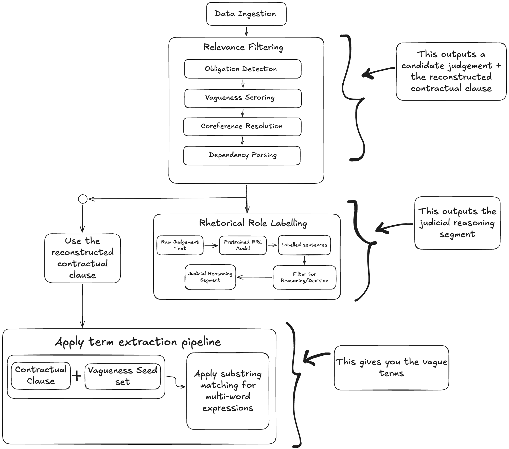

# Dataset Contruction

The _triplet dataset_ needs to have the following structure:
- A contractual clause
- Vague term(s)
- Judicial interpretation and reasoning

Things that need to be answered first:

1. First, I understand that the triplet structure will include a contractual clause, the vague term(s) in that clause, and the judicial reasoning. But the pipeline: extract judgments, apply rhetorical role labelling to isolate reasoning segments, link them to cited clauses -- I am not sure as to how to do this; i am clueless. And where do I source the raw judgements from? I mentioned  the US Caselaw Access Project, ECHR-OD, and the Pile-of-Law. But I have not investigated them throughly yet.

2. Second, I don't know how I am going to filter for relevance. Not every judgement will include a disputed vague obligation term. So I need to identify which cases are actually useful before spending time in processing them. 

3. Third, and this is a question: who or what produces the rhetorical labels? I need to isolate the Reasoning and Decision segments from raw judicial texts. How is this going to happen?

### 2. Relevance Filtering Pipeline:

Given a particular judgement, we need to identify whether it contains a disputed vague obligation term or not. For this, the following pipeline will be leveraged:

1. Obligation detection: Leverage SparkNLP to flag whether a document/opinion contains a vague obligation term or not. Identify the _Party_ + _Modal verb_ + _Action_

2. Vagueness scoring: Use vector embeddings to compare against a _Vagueness Seed Set_ (contains the different vague terms used in formal legal language), and identify high-probability vague obligations

3. Coreference resolution: Track entities across sentences where the vague obligations might have leaked across sentences, or are burried under formal legal language. Track entities across sentence boundaries, and identify which sentences belong to the same obligation

4. Dependency parsing within the linked sentences to reconstruct the fill scattered clause as a unified proposition

### 3. Rhetorical role labelling

The base dataset for this is [LegalSeg](https://arxiv.org/pdf/2502.05836) (find the datasets on [HuggingFace](https://huggingface.co/L-NLProc/datasets) or the [github repository](huggingface.co/L-NLProc/datasets)). There are existing pretrained models for this task.

## Triplet Dataset Construction Workflow:

